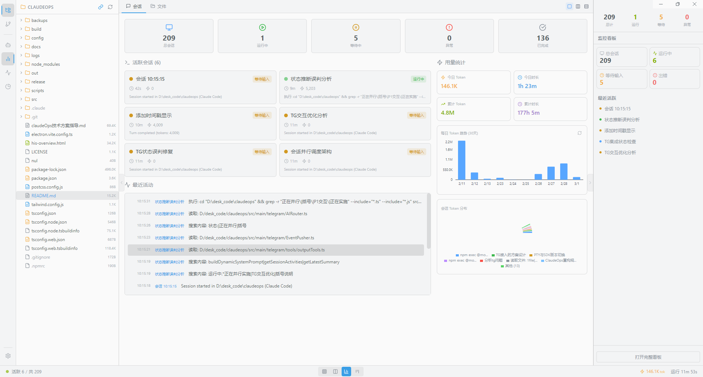
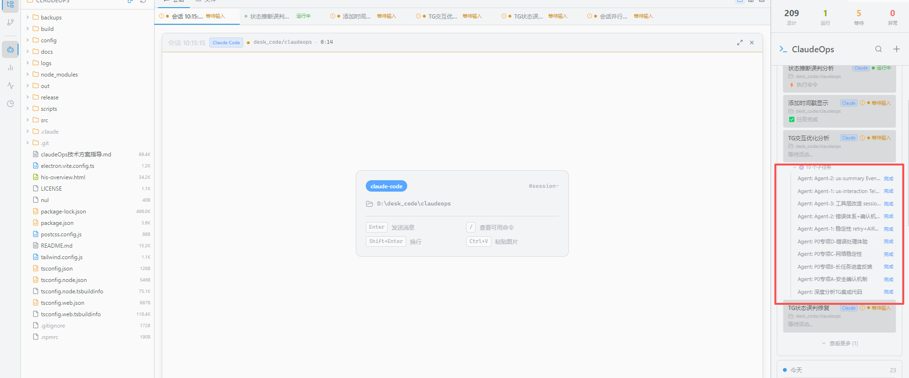
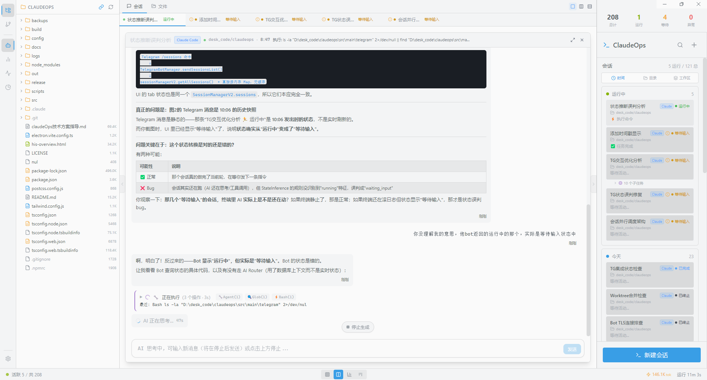
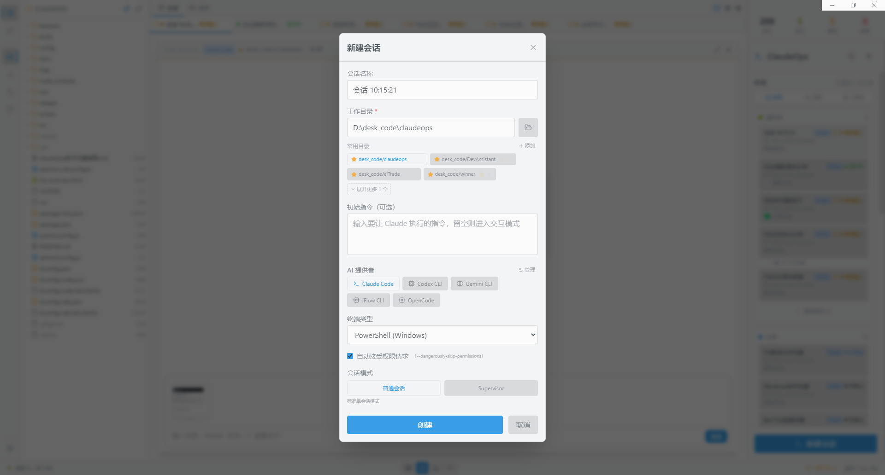
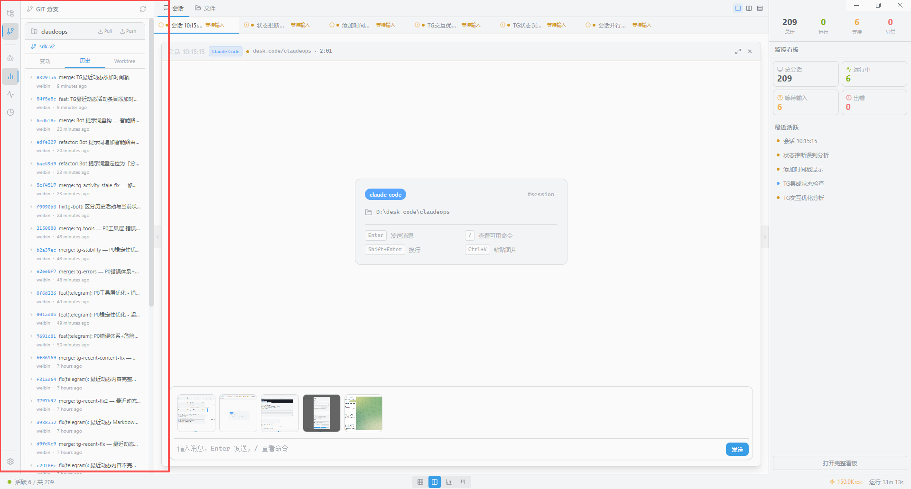
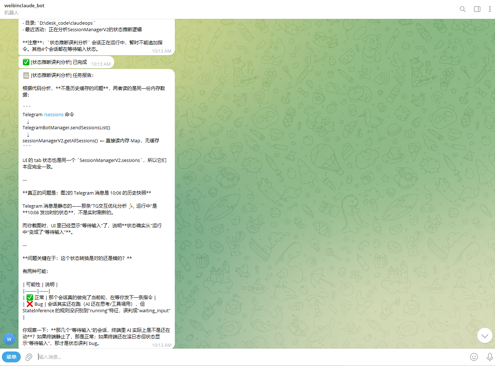

# SpectrAI

> Worktree 测试行 - 由 Claude 添加于 2026-03-05，验证 worktree 查看功能

   

**多 AI CLI 会话编排与管控平台**。在一个桌面应用中同时管理多个 AI 会话，提供结构化对话视图、看板式任务管理、实时状态监控、Agent 编排、工作流自动化和远程控制。

---

## 界面预览

### 主控制台 — 多会话概览 + 用量统计



> 左侧项目文件树，中央展示活跃会话卡片（运行中/等待输入状态实时标注），右侧实时监控看板包含会话汇总、最近活跃列表、30 天 Token 趋势图与会话 Token 分布饼图。已累计管理 **209 个会话**，消耗 **4.8M Token**，运行 **177 小时**以上。

---

### 多标签页视图 + Agent 子任务追踪



> 顶部标签栏支持多会话并排切换，右侧 SpectrAI 面板实时展示每个会话的 Agent 子任务列表及其状态（运行中/已完成），一次 Supervisor 任务可展开多达十余个并行子 Agent。

---

### 结构化对话视图



> 每个会话以结构化消息气泡展示 AI 回答，支持 Markdown 渲染（代码块、表格、列表），工具调用（Agent / Glob / Bash 等）以内联标签呈现，实时显示"AI 正在思考..."与工具执行进度，右侧面板同步更新会话时间线。

---

### 新建会话 — 多 Provider 选择



> 支持 **Claude Code、Codex CLI、Gemini CLI、iFlow CLI、OpenCode** 五种 AI 提供者，可收藏常用工作目录，填写初始指令（留空则进入交互模式），选择终端类型（PowerShell / CMD / Bash），一键开启自动接受权限请求，或切换为 **Supervisor 模式**让 AI 自动编排子 Agent。

---

### 文件资源管理器 — AI 改动实时追踪


> 左侧文件树实时展示会话工作目录，AI 改动的文件右侧自动出现 **蓝色圆点** 标注；顶部"会话改动列表"按 创建 / 修改 / 删除 分类展示所有变动文件，点击可在右侧代码查看器中预览内容。支持多会话并发改动归因，竞态冲突自动标记警告图标。

---

### Git 分支管理面板 + 图片粘贴



> 内置 Git 分支管理面板，支持查看提交历史（定位 / 历史 / Worktree 三视图），直接在对话输入框通过 **Ctrl+V 粘贴图片**发送给 AI，实现多模态交互。

---

### Telegram Bot 远程控制



> 通过 Telegram Bot 随时接收会话完成通知、错误告警，获取结构化的任务分析报告（支持 Markdown 表格、代码块），并可远程发送指令控制会话。

---

### Agent Teams — 多角色 AI 协作

<!-- TODO: 补充截图 docs/screenshots/agent-teams.png -->

> 创建由多个 AI 角色组成的团队，每个角色独立使用不同的 AI Provider（Claude/Codex/Gemini/iFlow）。团队成员通过 **SharedTaskList**（DB 持久化任务队列）原子认领任务，通过 **TeamBus** 点对点消息路由协作，全程对话和任务进度可视化追踪。

---

## 核心功能

### 多会话管理
- 同时运行多个 AI CLI 会话，会话列表按时间自动分组（运行中 / 今天 / 历史）
- **结构化对话视图** — AI 回答以消息气泡呈现，工具调用以卡片展示，不再是裸终端输出
- **多标签页切换** — 顶部标签栏支持多会话并排浏览，支持聚焦、网格、仪表盘等视图切换
- 会话恢复 — 保存 Claude 会话 ID，支持 `--resume` 续接多轮对话（Claude Code 专属）
- **图片粘贴** — 在会话输入框 Ctrl+V 直接粘贴图片，发送给 AI 进行多模态分析

### Provider Adapter 架构
统一 `BaseProviderAdapter` 抽象层，屏蔽各 CLI 的通信差异，每个 Provider 独立实现：

| Provider | 通信方式 | 特性 |
|----------|----------|------|
| **Claude Code** | Agent SDK V2 | 可恢复、自动接受、会话追踪 |
| **Codex CLI** | JSON-RPC (`codex serve`) | 自动接受 |
| **Gemini CLI** | NDJSON 流式 | 自动接受 |
| **iFlow CLI** | ACP 协议 | 自动接受 |
| **OpenCode** | 可配置命令行 | 自动接受 |
| **自定义提供者** | 可配置命令行 | 用户自定义 |

- `AdapterRegistry` 工厂注册，`toolMapping` 统一事件映射
- 每个 Provider 可独立配置启动参数、Node.js 版本、状态推断阈值
- 支持 **自定义 AI 提供者**（Settings → AI 提供者管理 → 添加自定义 AI 提供者）

### Agent 编排系统
完整的 MCP（Model Context Protocol）基础设施，让 Claude 能够自动创建和管理子会话：
- **spawn_agent** — 创建子 Agent（支持一次性 oneShot 和持久多轮对话模式）
- **send_to_agent** — 向持久 Agent 发送追加指令
- **wait_agent / wait_agent_idle** — 等待 Agent 完成或进入空闲
- **get_agent_output / get_agent_status / list_agents** — 监控 Agent 状态
- **cancel_agent** — 终止 Agent
- **Supervisor 模式** — 自动注入 System Prompt，引导 Claude 使用 Agent 工具进行任务分解
- **子任务实时追踪** — 右侧面板动态展示所有 Agent 子任务的运行状态与完成情况

### Agent Teams — 多角色 AI 协作
区别于 Supervisor 单中心调度，Teams 是去中心化的多 AI 并行协作模式：

| 特性 | 说明 |
|------|------|
| **多 Provider 混搭** | 每个角色独立选择 Claude / Codex / Gemini / iFlow，扬长避短 |
| **SharedTaskList** | SQLite 持久化任务队列，原子 `WHERE status='pending'` 认领，零冲突 |
| **TeamBus 消息总线** | P2P 路由，支持单播（指定角色）和广播，角色间直接通信 |
| **MCP 原生工具集** | 5 个 MCP 工具：`team_message_role` / `team_broadcast` / `team_claim_task` / `team_complete_task` / `team_get_tasks` |
| **DB 持久化** | 6 张表（teams / roles / instances / members / tasks / messages），重启后历史完整保留 |
| **可视化追踪** | TaskKanban 看板实时展示任务流转，TeamMessageFlow 对话流展示成员通信 |

**支持团队模板化**：预定义角色分工（如"需求分析师 + 架构师 + 前端 + 后端 + 测试"），一键启动团队实例，填入目标即可开始协作。

### 文件资源管理器
- **文件树** — 实时展示会话工作目录，支持展开/折叠、双击打开文件预览
- **AI 改动追踪** — FS Watch 实时监听（300ms debounce），改动文件右侧显示蓝色圆点
- **会话改动列表** — 列出该会话的所有创建 / 修改 / 删除文件，支持点击在代码查看器中预览
- **多会话归因** — 多个会话同时运行时，按工作目录深度 + 最近活动时间自动归因，竞态冲突标记警告
- **Worktree 支持** — Worktree 会话 merge 后通过 `git diff` 归因，记录完整改动历史
- **自动跟随** — 默认跟随当前选中会话的工作目录，可手动解除切换任意目录

### Git 分支管理面板
- 内置 **GIT 分支** 侧边栏，支持定位 / 历史 / Worktree 三视图切换
- 一览提交历史，commit 消息直接在面板中显示
- **Git Worktree 隔离** — 为每个任务创建独立分支，完成后合并，彻底隔离代码修改

### 看板式任务管理
- 四列看板：待办 → 进行中 → 等待中 → 已完成
- 拖拽排序、优先级标记（高/中/低）
- 任务关联会话，一键创建会话执行任务

### 工作流引擎
- DAG 依赖解析，支持串行/并行多步骤执行
- 步骤间输出路由和数据传递
- 手工审核步骤支持
- 内置工作流模板（代码审查、文档生成、调研撰写）

### 自主规划引擎
- 接收高级目标，LLM 驱动自动分解为子任务
- 通过 Agent 池并发执行，依赖追踪
- 结果聚合与汇总

### Telegram 远程控制
- Telegram Bot 集成，随时随地管理会话
- 多 AI Provider 路由（Deepseek、通义千问、GPT-4 等）
- 事件推送 — 完成通知、错误告警、卡住提醒
- **结构化消息** — 任务报告以 Markdown 表格、代码块形式推送，信息清晰易读
- 远程工具 — 查询会话状态、发送命令、获取输出

### 实时监控看板
- 会话总览：总会话数 / 运行中 / 等待中 / 异常 / 已完成
- **Token 用量统计**：今日 / 累计 Token 消耗、今日 / 累计运行时长
- **30 天 Token 趋势图**（Recharts 柱状图）
- **会话 Token 分布饼图**，直观显示各会话的 Token 占比
- 最近活动实时流，精确到秒的操作时间线

### 代理与网络
- 内置代理设置（HTTP / SOCKS5），用于 AI 连接 Anthropic / Telegram 等服务
- Windows 下自动从环境变量或 PowerShell profile 读取系统代理

### 数据持久化与统计
- SQLite + Repository 模式（Session / Conversation / Task / Usage 等多个仓库）
- **结构化存储 AI 对话消息**（ConversationMessage），支持历史回溯
- Token 用量统计与可视化仪表盘（日/累计 Token、时长、Token 分布饼图）
- 会话 AI 回答摘要提取与跨会话感知
- 日志自动归档（默认 30 天保留）

---

## 技术栈

| 类别 | 技术 |
|------|------|
| **框架** | Electron 28 + React 18 + TypeScript 5 |
| **构建** | electron-vite + Vite 5 |
| **AI 接入** | @anthropic-ai/claude-code Agent SDK V2 + 各 CLI 适配器 |
| **状态管理** | Zustand |
| **存储** | better-sqlite3 (SQLite) + Repository 模式 |
| **UI** | Tailwind CSS + Lucide Icons + Allotment (分栏) |
| **拖拽** | @dnd-kit |
| **图表** | Recharts |
| **MCP** | @modelcontextprotocol/sdk |
| **通信** | WebSocket |
| **远程控制** | node-telegram-bot-api |

---

## 前置要求

- Node.js >= 18
- npm >= 9
- 至少安装一个支持的 AI CLI（`claude` / `codex` / `gemini` / `iflow` 等）
- Windows: 需要安装 [Visual Studio Build Tools](https://visualstudio.microsoft.com/visual-cpp-build-tools/)（用于编译 better-sqlite3 等原生模块）

## 快速开始

```bash
# 1. 安装依赖
npm install

# 2. 重建原生模块（better-sqlite3）
npm run rebuild

# 3. 启动开发模式
npm run dev
```

## 常用命令

| 命令 | 说明 |
|------|------|
| `npm run dev` | 启动开发模式（热重载） |
| `npm run build` | 构建生产版本 |
| `npm run build:win` | 构建 Windows 开发版 |
| `npm run build:mac` | 构建 macOS 开发版（`.app`） |
| `npm run dist` | 打包 Windows 安装程序（NSIS） |
| `npm run dist:mac` | 打包 macOS 安装程序（DMG + ZIP） |
| `npm run preview` | 预览生产构建 |
| `npm run rebuild` | 重建所有原生模块 |
| `npm run typecheck` | TypeScript 类型检查 |
| `npm run lint` | ESLint 代码检查 |

## macOS 运行排障（Finder 双击启动）

从 Finder 双击启动 `.app` 时，系统不会加载你的交互 shell 初始化脚本，`PATH` 可能缺少 Homebrew/nvm 目录，导致 `claude/codex/gemini/iflow` 被误判为“未安装”。

当前版本已在主进程启动时自动引导 shell PATH。若仍无法启动会话，请按以下顺序排查：

1. 在 `Settings -> AI Provider` 中把对应 Provider 的 `command` 改为绝对路径（例如 `/Users/xxx/.nvm/versions/node/v20.19.4/bin/codex`）。
2. 若使用 Gemini 且指定了 `nodeVersion`，确认本机存在 `~/.nvm/versions/node/v<version>/bin/node`。
3. 重新启动应用后，在 Provider 管理中执行 CLI 检测，确认状态从“未找到”变为“已找到”。

---

## 项目结构

```
src/
├── main/                          # Electron 主进程
│   ├── index.ts                   # 主进程入口
│   ├── adapter/                   # ★ Provider Adapter 层
│   │   ├── types.ts               # BaseProviderAdapter 抽象类型
│   │   ├── AdapterRegistry.ts     # 工厂注册
│   │   ├── toolMapping.ts         # 工具事件统一映射
│   │   ├── ClaudeSdkAdapter.ts    # Claude Code（Agent SDK V2）
│   │   ├── CodexAppServerAdapter.ts # Codex CLI（JSON-RPC）
│   │   ├── GeminiHeadlessAdapter.ts # Gemini CLI（NDJSON）
│   │   └── IFlowAcpAdapter.ts     # iFlow CLI（ACP 协议）
│   ├── session/                   # 会话管理
│   │   ├── SessionManagerV2.ts    # ★ 薄协调层（事件驱动）
│   │   ├── SessionManager.ts      # 旧版 PTY 会话管理（兼容保留）
│   │   ├── ConcurrencyGuard.ts    # 并发控制
│   │   └── types.ts
│   ├── agent/                     # Agent 编排基础设施
│   │   ├── AgentManagerV2.ts      # ★ 确定性 turn_complete 就绪检测
│   │   ├── AgentManager.ts        # 旧版 Agent 管理器
│   │   ├── AgentBridge.ts         # WebSocket 桥接
│   │   ├── AgentMCPServer.ts      # MCP 服务器（独立进程）
│   │   ├── AgentReadinessDetector.ts
│   │   ├── MCPConfigGenerator.ts
│   │   ├── LLMService.ts
│   │   ├── BriefingManager.ts
│   │   └── supervisorPrompt.ts    # Supervisor 模式提示注入
│   ├── tracker/                   # 文件改动追踪
│   │   └── FileChangeTracker.ts   # FS Watch + 多会话归因 + DB 持久化
│   ├── team/                      # ★ Agent Teams 多角色协作
│   │   ├── types.ts               # Team 类型定义（TeamDefinition / TeamInstance 等）
│   │   ├── SharedTaskList.ts      # DB 持久化任务队列（原子认领）
│   │   ├── TeamBus.ts             # P2P 消息总线（单播 + 广播）
│   │   └── TeamManager.ts        # 团队生命周期协调器
│   ├── ipc/                       # IPC 通信（模块化）
│   │   ├── index.ts
│   │   ├── sessionHandlers.ts
│   │   ├── agentHandlers.ts
│   │   ├── taskHandlers.ts
│   │   ├── providerHandlers.ts
│   │   ├── gitHandlers.ts
│   │   ├── fileManagerHandlers.ts # 文件树 / 目录监听 / 会话改动查询
│   │   ├── teamHandlers.ts        # ★ Team IPC 通道（14 个 team:* 频道）
│   │   ├── telegramHandlers.ts
│   │   └── systemHandlers.ts
│   ├── storage/                   # 数据持久化
│   │   ├── Database.ts            # SQLite 连接池
│   │   └── repositories/          # Repository 模式
│   │       ├── SessionRepository.ts
│   │       ├── ConversationRepository.ts
│   │       ├── TaskRepository.ts
│   │       ├── UsageRepository.ts
│   │       ├── ProviderRepository.ts
│   │       ├── TeamRepository.ts  # ★ teams/roles/instances/members/tasks/messages
│   │       └── ...
│   ├── parser/                    # 输出解析引擎（PTY 兼容层）
│   │   ├── OutputParser.ts        # 50+ 规则
│   │   ├── StateInference.ts      # 双重状态推断
│   │   ├── ConfirmationDetector.ts
│   │   ├── UsageEstimator.ts
│   │   └── rules.ts / codexRules.ts / geminiRules.ts ...
│   ├── orchestrator/              # 工作流编排引擎
│   │   ├── Orchestrator.ts        # DAG 工作流引擎
│   │   ├── PromptTemplate.ts
│   │   ├── InputInjector.ts
│   │   └── builtinWorkflows.ts
│   ├── git/                       # Git Worktree 隔离
│   │   └── GitWorktreeService.ts
│   ├── reader/                    # 结构化输出读取
│   │   ├── ClaudeJsonlReader.ts   # JSONL 格式解析
│   │   └── OutputReaderManager.ts
│   ├── planner/                   # 自主规划引擎
│   │   └── AutonomousPlanner.ts
│   ├── task/                      # 任务-会话协调
│   │   └── TaskSessionCoordinator.ts
│   ├── suggestion/                # 智能建议引擎
│   │   └── SuggestionEngine.ts
│   ├── telegram/                  # Telegram 远程控制
│   │   ├── TelegramBotManager.ts
│   │   ├── AIRouter.ts
│   │   ├── EventPusher.ts
│   │   └── tools/
│   ├── notification/              # 桌面通知
│   └── tray/                      # 系统托盘
├── renderer/                      # React 渲染进程
│   ├── components/
│   │   ├── layout/                # 三栏分栏布局
│   │   ├── conversation/          # ★ 结构化对话视图
│   │   │   ├── ConversationView.tsx
│   │   │   ├── MessageBubble.tsx
│   │   │   ├── ToolUseCard.tsx
│   │   │   └── MessageInput.tsx
│   │   ├── file-manager/          # ★ 文件资源管理器
│   │   │   ├── FileManagerPanel.tsx    # 主面板（文件树 + 改动列表）
│   │   │   ├── FileTree.tsx            # 递归文件树渲染
│   │   │   ├── FileTreeNode.tsx        # 单节点（蓝点改动指示）
│   │   │   ├── SessionChangedFiles.tsx # 会话改动文件列表
│   │   │   ├── FilePane.tsx            # 文件预览窗格
│   │   │   ├── FileTabs.tsx            # 文件标签页
│   │   │   └── CodeViewer.tsx          # 代码语法高亮查看器
│   │   ├── terminal/              # 终端组件（PTY 兼容层）
│   │   ├── kanban/                # 看板组件（拖拽排序）
│   │   ├── team/                  # ★ Agent Teams UI 组件
│   │   │   ├── TeamSessionView.tsx    # Teams 主视图（模板选择 + 实例列表）
│   │   │   ├── CreateTeamModal.tsx    # 团队定义创建/编辑弹窗
│   │   │   ├── TaskKanban.tsx         # 任务看板（实时流转）
│   │   │   ├── TeamMemberCard.tsx     # 成员状态卡片
│   │   │   └── TeamMessageFlow.tsx    # 成员间通信消息流
│   │   ├── workflow/              # 工作流编辑器与执行器
│   │   ├── dashboard/             # 数据可视化仪表盘
│   │   ├── usage/                 # 用量统计面板
│   │   ├── settings/              # 设置（Provider/代理/Telegram）
│   │   └── suggestion/            # 智能建议栏
│   ├── stores/                    # Zustand 状态管理
│   │   ├── sessionStore.ts        # 会话 + 对话状态
│   │   ├── settingsStore.ts       # 全局设置状态
│   │   ├── taskStore.ts
│   │   ├── teamStore.ts           # ★ Team 状态（定义 / 实例 / 任务 / 消息）
│   │   ├── workflowStore.ts
│   │   ├── plannerStore.ts
│   │   └── telegramStore.ts
│   └── hooks/
│       ├── useConversation.ts     # ★ 对话消息 Hook
│       └── useTerminal.ts
├── preload/                       # Electron preload（contextBridge）
│   └── index.ts                   # sendMessage/getConversation/respondPermission 等
└── shared/                        # 主进程/渲染进程共享
    ├── types.ts                   # ConversationMessage, AdapterType, AIProvider 等
    └── constants.ts               # IPC 通道、主题、快捷键
```

---

## 使用方式

1. 启动后点击左下角 **新建会话**
2. 填写会话名称、选择工作目录（支持收藏常用目录），选择 AI 提供者
3. 可选填写 **初始指令**（AI 启动后自动执行），留空则进入交互模式
4. 对话区域以结构化消息气泡展示 AI 回答，可在输入框继续交互，支持 **Ctrl+V 粘贴图片**
5. 切换到 **文件** 标签页查看文件资源管理器：左侧文件树自动跟随会话工作目录，AI 改动的文件显示蓝色圆点；顶部"会话改动"折叠面板列出所有变动文件，点击可预览内容
6. 在左侧看板中管理任务，拖拽调整状态
7. 使用工作流编辑器创建多步骤自动化流程
8. 开启 **Supervisor 模式**让 Claude 自动编排子 Agent，右侧面板实时追踪子任务进度
9. 点击 **新建会话 → Teams 模式**，选择或创建团队模板（定义角色分工和各角色使用的 AI Provider），填入任务目标后启动——多个 AI 角色将自动并行协作、认领任务、互相通信，TaskKanban 看板实时展示进度
10. 通过左侧 **GIT 分支** 面板查看提交历史并管理 Worktree 隔离分支

### 快捷键

| 快捷键 | 功能 |
|--------|------|
| `Ctrl+1` | 网格视图 |
| `Ctrl+2` | 标签页视图 |
| `Ctrl+3` | 聚焦视图 |
| `Ctrl+4` | 仪表盘视图 |
| `Ctrl+Tab` | 循环切换会话 |
| `Ctrl+N` | 新建会话 |
| `Ctrl+Shift+N` | 新建任务+会话 |
| `Ctrl+B` | 切换侧边栏 |
| `Ctrl+F` | 全文搜索 |
| `Ctrl+Shift+T` | 切换主题 |
| `Ctrl+V` | 粘贴图片到会话输入框 |

---

## 架构亮点

### Provider Adapter 层
```
用户操作 / Agent 指令
  → SessionManagerV2（薄协调层，事件驱动）
  → AdapterRegistry.getAdapter(adapterType)
  → 具体 Adapter（ClaudeSdk / Codex / Gemini / IFlow / OpenCode）
      ├── Claude: Agent SDK V2，结构化事件流
      ├── Codex:  JSON-RPC (codex serve)，工具调用映射
      ├── Gemini: NDJSON 流式解析，思考过程提取
      ├── iFlow:  ACP 协议，标准化消息格式
      └── OpenCode: 命令行适配，自动接受
  → toolMapping 统一事件格式
  → ConversationMessage 持久化 + IPC 广播
  → Zustand Store → React 对话视图
```

### AgentManagerV2 — 确定性就绪检测
通过 `turn_complete` 事件而非超时推断来判断 Agent 就绪状态，消除了旧版 PTY 架构中 Prompt Marker 解析不稳定导致的竞态问题。

### Repository 模式存储层
各业务领域（Session / Conversation / Task / Usage / Provider 等）各自拥有独立 Repository，Database 作为统一连接池，避免跨领域耦合。

### MCP Agent 协议
Agent 子会话通过 WebSocket 桥接与 MCP Server 通信，Supervisor 会话可动态 spawn 子 Agent，实现多层级任务分解。支持一次性（oneShot）和持久多轮对话两种模式。

### Agent Teams — 去中心化多 AI 协作架构
```
用户创建团队实例（选择模板 + 填入目标）
  → TeamManager 按角色定义批量 spawn Agent（oneShot=false，持久模式）
  → 每个角色 Agent 启动后收到 System Prompt（角色职责 + 可用 MCP 工具）
  → Agent 通过 MCP 工具与 TeamManager 交互：
      ├── team_claim_task      — 从 SharedTaskList 原子认领任务
      ├── team_complete_task   — 标记任务完成，传递产出
      ├── team_message_role    — 单播：向指定角色发送消息（TeamBus 路由）
      ├── team_broadcast       — 广播：向全体成员发送消息
      └── team_get_tasks       — 查询当前任务队列状态
  → TeamBus 路由消息，收件方 Agent 通过 send_to_agent 接收
  → 所有事件通过 IPC 推送到渲染进程 → teamStore → TaskKanban / TeamMessageFlow 实时更新
  → SQLite 持久化：teams / roles / instances / members / tasks / messages（重启不丢失）
```

与 Claude 官方 Agent Teams 的对比优势：
- **多 Provider 混搭**：每个角色独立选择最适合的 AI（Claude 做架构、Gemini 读大文件、Codex 写代码）
- **完全本地运行**：数据不离开本机，无需云端调度服务
- **可视化实时追踪**：TaskKanban + TeamMessageFlow 直观展示协作过程
- **模板化复用**：团队定义可保存为模板，一键复用到新任务

---

## 常见问题

### `npm run dev` 报 better-sqlite3 错误

原生模块需要针对 Electron 的 Node 版本重新编译：

```bash
npm run rebuild
```

### 中文路径导致编译失败

如果项目位于中文路径下，MSVC 编译可能出错。建议将项目迁移到纯英文路径，或：

```bash
npm install better-sqlite3 --build-from-source=false
```

### AI CLI 未找到

确保对应的 AI CLI 命令已在系统 PATH 中，例如：

```bash
claude --version   # Claude Code
codex --version    # Codex CLI
gemini --version   # Gemini CLI
```

### AI 无法连接（网络问题）

前往 **设置 → 通用 → 代理设置**，配置 HTTP 或 SOCKS5 代理。

---

## License

MIT
